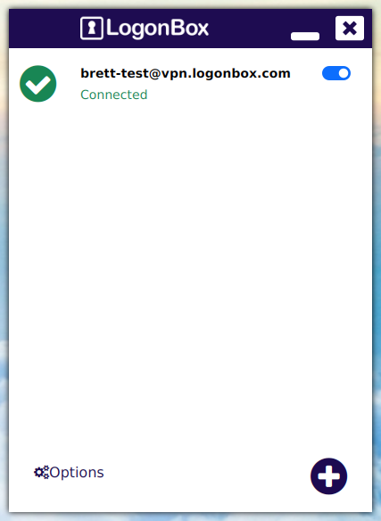

# Client Style Guidelines and API

This document describes the general look and feel we should apply to our cross platform clients. Being as there will be 5 different operating systems supported, using 2 different platforms, there will of course be differences. However, we should 
attempt to keep these differences to a minimum so that the application will be familiar to users if they happen to hop across operating systems. 

Also described, is the configuration delivery API, that all clients must implement to support LogonBox MFA.

## Client Style

This guide describes how the VPN client will look, not how the current stable version (2.4.0) looks. You can enable the new look client by creating the file `$HOME/.logonbox-vpn-client/gui.conf.d`  (creating the folder if it doesn't exist), and placing the line `system logonbox.vpn.newUI=true` inside this file. Note, this is very much still work in progress.

**Some layout and styling may not make sense on other platforms. Use your judgement!**
      
### Adding A New Connection

If there are no existing connections upon starting the app, you are taken immediately to the *Add Connection* page.

The *Name* field can be left blank, in which case, the full name will be generated dynamically by prepending the username to the hostname portion of the server address. E.g. if the user authenticates as `brett`, and the host is `vpn.logonbox.com`, then the full default display name will be `brett@vpn.logonbox.com`. This can be overidden by any free text.

The *Server Address* field should be able to accept this address in multiple formats. Using [vpn.logonbox.com](https://vpn.logonbox.com) as an example  :-

 * vpn.logonbox.com - Simple the FQDN of the VPN server
 * vpn.logonbox.com:443 - FQDN of the server with optional port number
 * https://vpn.logonbox.com - Base URL of the VPN server
 * https://vpn.logonbox.com:443 - Base URL of the VPN server with optional port number
 * https://vpn.logonbox.com/app - Full URL of the VPN server with optional application path
 * https://vpn.logonbox.com:443/app - Full URL of the VPN server with optional port and application path
 
It should also accept all of the above, but with IPv4 or IPv6 addresses in stead of hostnames.

*Connect to this network when my computer starts* will mean the connection is made as soon as the system service starts. This may or may not apply on mobile operating systems. 

*Stay connected to this network* will mean that if there are transient problem with the underlying connection, such as loss of internet connection, or if the server is rebooted, then the connection will go into a "Temporarily Offline" state, and will keep trying to reconnect. When this is turned off, then when such conditions occur, the client will inform the user and disconnect permanently. The user would then have to manually start the connection again.

#### Editing A Connection

The *Edit* action is available in various place, this takes you to a page that is exactly the same as the Add Connection page, but with the details already populated.

### Connection List

Once you have at least one connection, the connection list page is show. 

  * Each row shows a large icon as an overview of the connection status on the left.
  * The centre of a row shows the *Display Name* and the connection status as text. If there is any, the last error will be shown next to the status text.
  * The right of a row is a switch to turn the connection on and off
  * Optionally, the row can have a context menu with *Delete*, *Edit* and *Favourite* options. These actions are repeated in the Connection Details Page. 
    
  * Clicking the row itself takes you to the Connection Details page.
  
#### Activating A Connection

If you click the switch to activate a connection, the large icon turns to a busy spinner and the status text will change. What happens next depends on the status and validity of the wireguard configuration associated with the connection. 

  * If this a new connection, the client will redirect to the LogonBox logon window. It is at this point the first remote HTML content is retrieved. See the **API** section below for details on what to do here.
  
  * If this is an existing connection, an attempt will be made to connect.
  
##### Connecting

 
Because Wireguard is stateless, if a connection "fails", we do not really know why. The only information we have is that Wireguard hasn't sent a handshake for a certain amount of time. For example, we cannot know if :-

 * Because of transient network issues, i.e. internet disconnected.
 * Because the server is down.
 * Because the configuration is invalid.

To overcome this, we do the following :-

The client will wait for 10 seconds for a Wireguard handshake. If a handshake is received within those 10 seconds, then the connection is still valid and the large status icon will change to a green tick and the status text updated accordingly. 

If a handshake is *not* received after 10 seconds, then the client attempts to "ping" the HTTPS service. If the HTTPS service can be reached, then we assume the service itself is OK, but the configuration must now be invalid. In this case, we again redirect to the LogonBox logon window. 

If the service *cannot* be reached, then we assume there is some problem with the internet connection, or the server itself and display an error to the user.

#### Connected

  
### Connection Details

The *Connection Details* page shows a detailed read-only view of the configuration and state of the selected connection. 
It is split into two sections (tabs). 

High level connection actions are also available here.

The top right actions are :-

 * Edit Connection
 * Delete Connection. 
 * Activate / Deactive Connection. Clicking this has the same effect as in the *Connection List* page (in fact that page should be activated when clicking here).
 
The details shown will depend on whether the connection has obtained its VPN configuration from the server yet, and if it is active or not. 

#### Details When Disconnected
 
When Disconnected, state that is only available when connected is hidden (e.g. handshake etc).

#### Advanced Details

If a Configuration has been obtained from the server, the Advanced tab shows details of that configuration.

## API

An important part of the LogonBox VPN client is obtaining the *Configuration* from the LogonBox VPN Server. This is done by authenticating with that server using an embedded browser to a particular URL.

The user is then directed through LogonBox's usual logon process, and at the end a configuration is delivered back to the client. The client then saves this configuration, and will continue to use it with no further HTTP contact unless something goes wrong. 

### Starting The Login

The client implementation should call the URL and render the results:-

[https://server/app/logonBoxVPNClient/](https://server/app/logonBoxVPNClient/)

### Receiving The Configuration

The final page of  the login process (implemented as `deviceID.html` on the server), is responsible for deliver the configuration to the client. 

To achieve this, it expects the application hosting the page, i.e. the VPN client, to provide a JavaScript object that is bound to functions within the client.

You must implement the following functions and bind it the variable name `bridge`.

| Function | Return Type | Description |
|-------------|-----------------|----------------|
| getOS() | String | This must return a simple string describing the OS. Standard values are `windows`, `linux`, `osx` and `other`. For this new work, we should add `ios` and `android`. |
| getDeviceName() | String | This should return a pseudo human readable string, roughly equating to a semi unique device name. We are using the NetBIOS/ DNS hostname for the desktop client |
| getUserPublicKey() | String | This should only be present for **existing** connections, as it is not known until a configuration has been received. If it is unknown, `null` should be returned. |
| unjoin(String message) | None | This function will be called if there are any errors during the setup procedure. The client should disconnected, clean up, and display the provided message (if any). |
| configure(String usernameHint, String wgConf) | None | This supports the main purpose of this API, to deliver a Wireguard configuration from the server to the client. The username is considered a hint, although a strong one. The Wireguard configuration is the standard wireguard configuration file format, with some extensions. |

